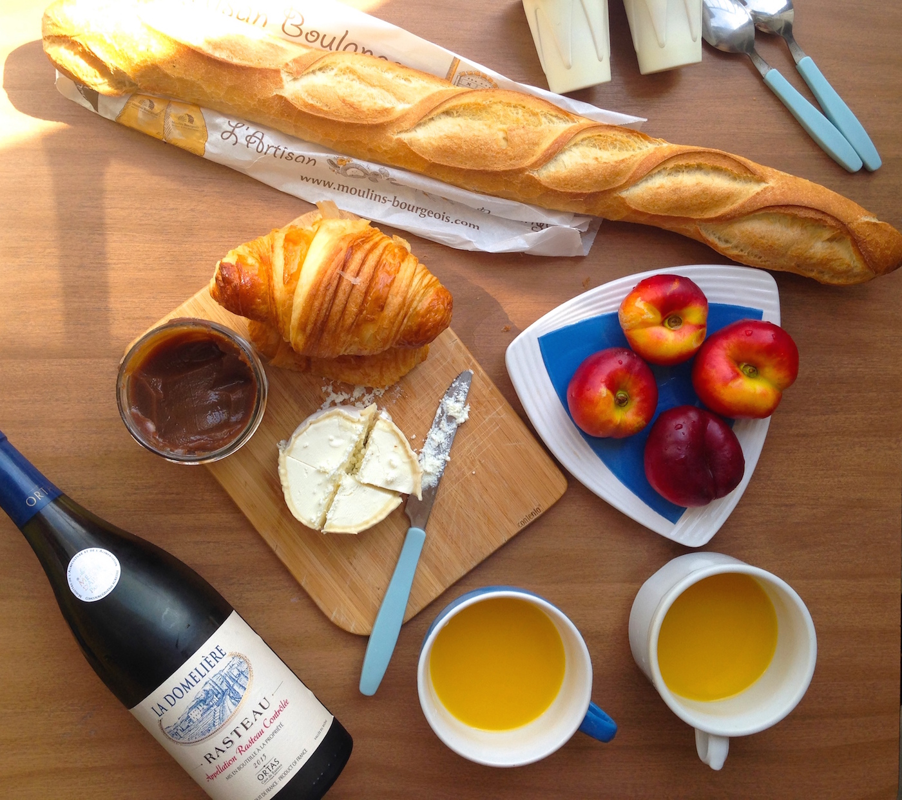

# Labelmaker
Labelmaker  is a jQuery plugin that allows you to tag your images and add comments with ease.


Checkout [the demo](/)!

Features:
* Responsive
* Supports links and images in comments
* Comment bubbles always fit within the image
* Bubbles scroll inside if the comment is long enough 

## Usage
1. Upload your image somewhere.
2. Paste your image link to the editor, then use it to add tags and comments to your image
3. Add the block generated by the editor below your image:

    ```
   
   <ul class="labelmaker-points">
     <li data-left="80" data-top="80">Orange juice</li>
     <li data-left="80" data-top="45">Yummy peaches</li>
   </ul>
   ```
4. Add jQuery and Labelmaker to your page, then run Labelmaker, passing the image and the point blocks to it:
5. 
    ```
    <script src="http://ajax.googleapis.com/ajax/libs/jquery/2.1.1/jquery.min.js"></script>
    <script src="jquery.labelmaker.min.js"></script>
    <link href="labelmaker.min.css" rel="stylesheet">

    <script>
      $('.labelmaker').labelmaker($('.labelmaker-points'));
    </script>
    ```

## Settings
You can choose whether to show comments on click or hover. Click is the default one, if you want hover, then:
```
<script>
  $('.labelmaker').labelmaker($('.labelmaker-points’), {showBubbleOn: ‘hover’});
</script>
```
